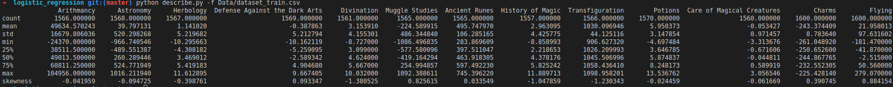
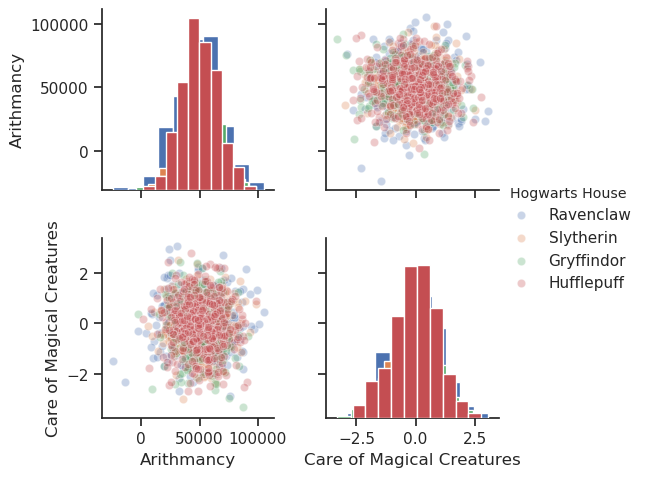
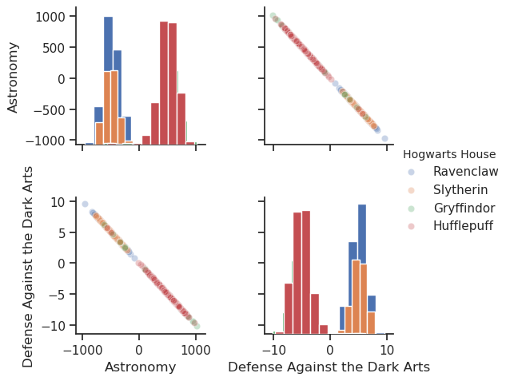
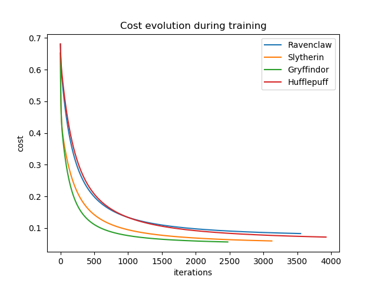

# logistic_regression

The objective of this project is to discover data analysis and reimplement logistic regression. The model trained will be able to predict the hogwart house for hogwarts students depending on their marks.

## Describe

This script copies the behaviour of the pandas describe

```
python describe.py -f Data/dataset_train.csv
```

<p align="center">

<p/>

## Histogram

```
python histogram.py -f Data/dataset_train.csv
```

This script shows similar features (similar distribution).

<p align="center">

<p/>

## Scatter_plot

```
python scatter_plot.py -f Data/dataset_train.csv
```

This script shows similar features (correlated).

<p align="center">

<p/>

## Pair_plot

```
python pair_plot.py -f Data/dataset_train.csv
```

This script shows the pair plot of all the features.

## Training

```
python logreg_train.py -f Data/dataset_train.csv
```

This script trains the model and gives the different cost history for the houses.

<p align="center">

<p/>

## Prediction

```
python logreg_predict.py -f Data/dataset_test.csv
```

This script takes the weights of the trained model to predict houses for students. Results are gathered in the file called `houses.csv`. 